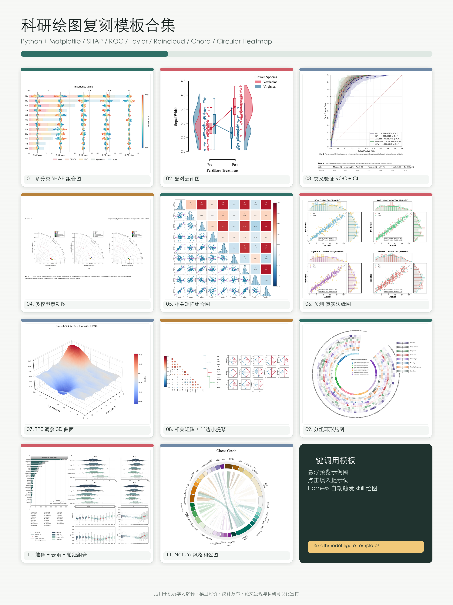
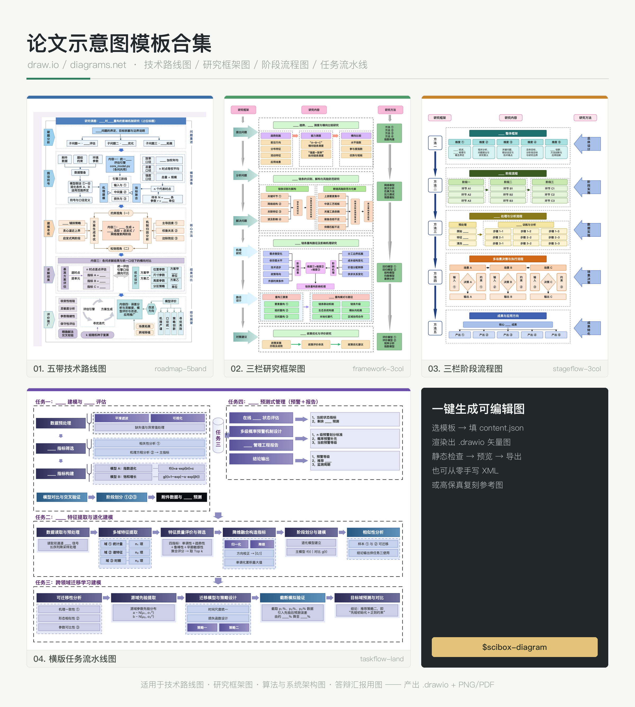

# sci-box

[中文](README.md)

Open-source Agent Skills for scientific work.

sci-box provides ready-to-use templates for scientific figures and research diagrams, helping agents produce publication-quality charts and editable vector diagrams.

## Usage

```
npx skills add jihe520/sci-box
```

## Skills

### `scibox-figure` — scientific figure templates

A Python + Matplotlib figure template collection covering SHAP, ROC, Taylor, raincloud, chord, circular heatmap, and related chart types, rendered to PNG / PDF / SVG in one command.



### `scibox-diagram` — research diagram templates (draw.io)

Produces **editable** draw.io / diagrams.net diagrams (`.drawio` plus PNG/PDF). Four built-in templates — five-band technical roadmap, three-column research framework, three-column stage flow, and landscape task pipeline — plus two other paths: authoring XML from scratch and high-fidelity replication of a reference figure. Ships with static layout checks, a browser preview, and export scripts.



## Third-party assets

`skills/scibox-diagram/assets/icons/tabler/` contains Tabler Icons (MIT); see
[ATTRIBUTION.md](skills/scibox-diagram/ATTRIBUTION.md).
